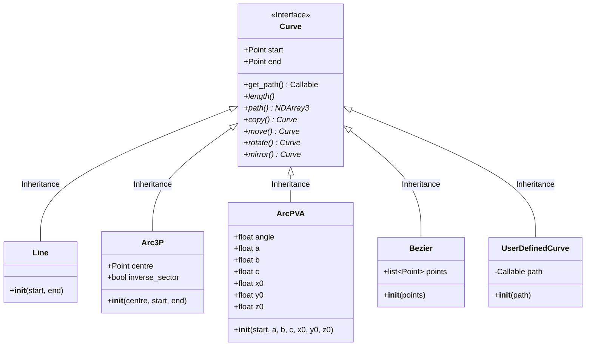

# Curves

```mermaid
classDiagram
    class Curve{
        +Point start
        +Point end
        +get_path() Callable
        +length()*
        +path() NDArray3*
        +copy() Curve*
        +move() Curve*
        +rotate() Curve*
        +mirror() Curve*
    }
    <<Interface>> Curve
    Curve <|-- Line : Inheritance
    Curve <|-- Arc3P : Inheritance
    Curve <|-- ArcPVA : Inheritance
    Curve <|-- Bezier : Inheritance
    Curve <|-- UserDefinedCurve : Inheritance
    class Line{
        +__init__(start, end)
    }
    class Arc3P{
        +Point centre
        +bool inverse_sector
        +__init__(centre, start, end)
    }
    class ArcPVA{
        +float angle
        +float a
        +float b
        +float c
        +float x0
        +float y0
        +float z0
        +__init__(start, a, b, c, x0, y0, z0)
    }
    class Bezier{
        +list~Point~ points
        +__init__(points)
    }
    class UserDefinedCurve{
        -Callable path
        +__init__(path)
    }
```
