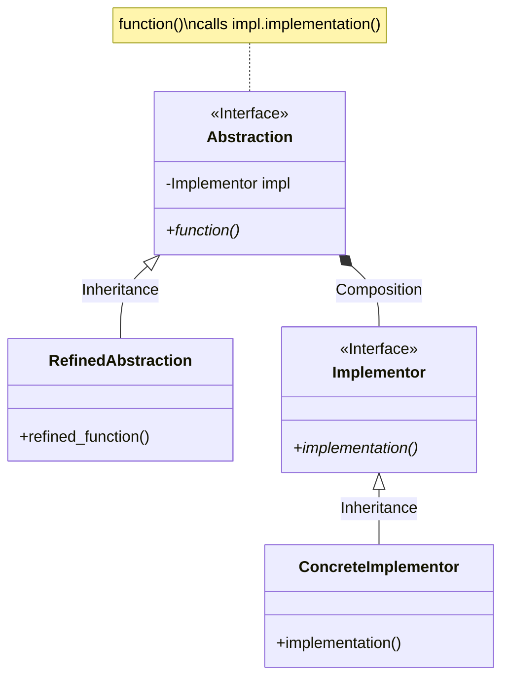

# Bridge Design Pattern

```mermaid
classDiagram
    class Abstraction{
        -Implementor impl
        +function()*
    }
    <<Interface>> Abstraction
    note for Abstraction "function()\ncalls impl.implementation()"
    class RefinedAbstraction{
        +refined_function()
    }
    class Implementor{
        +implementation()*
    }
    Abstraction *-- Implementor : Composition
    <<Interface>> Implementor
    class ConcreteImplementor{
        +implementation()
    }
    Abstraction <|-- RefinedAbstraction : Inheritance
    Implementor <|-- ConcreteImplementor : Inheritance
```
