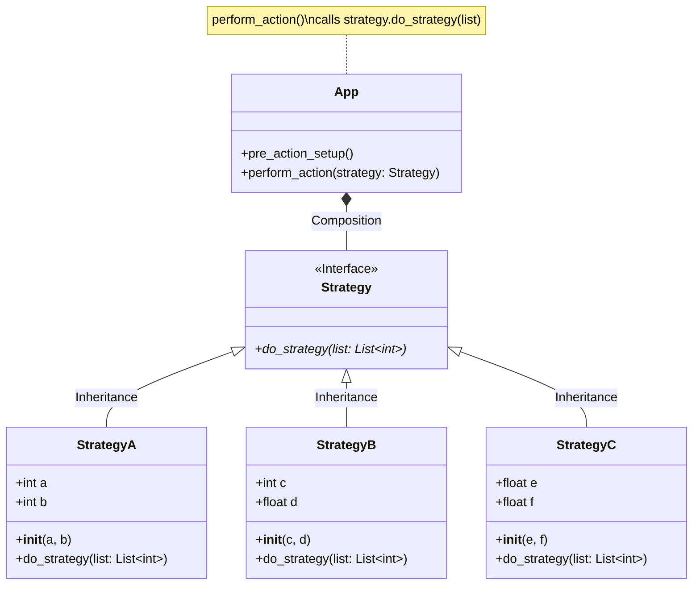

# Strategy Design Pattern

```mermaid
classDiagram
    class App{
        +pre_action_setup()
        +perform_action(strategy: Strategy)
    }
    App *-- Strategy : Composition
    note for App "perform_action()\ncalls strategy.do_strategy(list)"
    class Strategy{
        +do_strategy(list: List~int~)*
    }
    <<Interface>> Strategy
    Strategy <|-- StrategyA : Inheritance
    Strategy <|-- StrategyB : Inheritance
    Strategy <|-- StrategyC : Inheritance
    class StrategyA{
        +int a
        +int b
        +__init__(a, b)
        +do_strategy(list: List~int~)
    }
    class StrategyB{
        +int c
        +float d
        +__init__(c, d)
        +do_strategy(list: List~int~)
    }
    class StrategyC{
        +float e
        +float f
        +__init__(e, f)
        +do_strategy(list: List~int~)
    }
```
