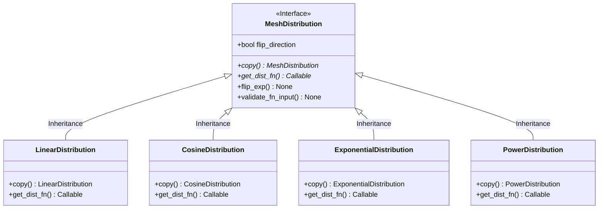

# Mesh Distributions

```mermaid
classDiagram
    class MeshDistribution{
        +bool flip_direction
        +copy() MeshDistribution*
        +get_dist_fn() Callable*
        +flip_exp() None
        +validate_fn_input() None
    }
    <<Interface>> MeshDistribution
    MeshDistribution <|-- LinearDistribution : Inheritance
    MeshDistribution <|-- CosineDistribution : Inheritance
    MeshDistribution <|-- ExponentialDistribution : Inheritance
    MeshDistribution <|-- PowerDistribution : Inheritance
    class LinearDistribution{
        +copy() LinearDistribution
        +get_dist_fn() Callable
    }
    class CosineDistribution{
        +copy() CosineDistribution
        +get_dist_fn() Callable
    }
    class ExponentialDistribution{
        +copy() ExponentialDistribution
        +get_dist_fn() Callable
    }
    class PowerDistribution{
        +copy() PowerDistribution
        +get_dist_fn() Callable
    }
```
