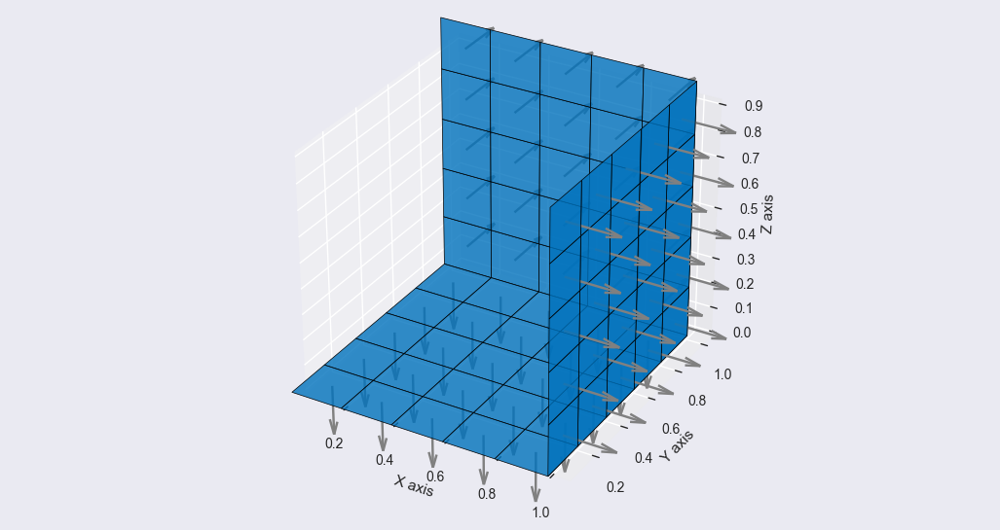

> *How-To-Guide coming soon.*
>
> The guide should inform about the following:
>
> * Writing gdf file using the `isx` and `isy` attributes.
> * Mesh generation using the `mirror` method.

## Utilizing Symmetry When Writing GDF File

```py linenums="1"" title="pymesh/examples/simple-symmetry-example.py"

import math
from pathlib import Path

from pymesh import Point, PlaneSurface
from pymesh import MeshGenerator, MeshViewer, GDFWriter

# Create bottom plate in the plane z=0
p000 = Point(0, 0, 0)
p100 = Point(1, 0, 0)
p010 = Point(0, 1, 0)
surface_z0 = PlaneSurface(p000, p010, p100)

# Create side plate in the plane x=1
p110 = Point(1, 1, 0)
p111 = Point(1, 1, 1)
surface_x1 = PlaneSurface(p110, p111, p100)

# Create side plate in the plane y=1
surface_y1 = PlaneSurface(p110, p010, p111)

# Add surfaces to the mesh generator and set mesh settings
mesh = MeshGenerator()
for surface in [surface_z0 surface_x1, surface_y1]:
    mesh.add_surface(
        surface,
        density_u=1,  # int specifies number of panels
        density_w=1,  # int specifies number of panels
    )

# Inspect the mesh geometry
viewer = MeshViewer(mesh)
viewer.show()

# Write mesh to a geometric data file
writer = GDFWriter(mesh)
writer.isx = True
writer.isy = True
writer.write(filename=Path("output", "simple-symmetry-example.gdf"))

```

### Inspecting the Geometry

!!! note
    Number of panels are not correct. There should be only 3 in total.



### Resulting GDF File

```
auto-generated using the pymesh package
1.000000 9.816000
1 1
3
+0.0000e+00 +0.0000e+00 +0.0000e+00 +0.0000e+00 +1.0000e+00 +0.0000e+00 +1.0000e+00 +1.0000e+00 +0.0000e+00 +1.0000e+00 +0.0000e+00 +0.0000e+00
+1.0000e+00 +1.0000e+00 +0.0000e+00 +1.0000e+00 +1.0000e+00 +1.0000e+00 +1.0000e+00 +0.0000e+00 +1.0000e+00 +1.0000e+00 +0.0000e+00 +0.0000e+00
+1.0000e+00 +1.0000e+00 +0.0000e+00 +0.0000e+00 +1.0000e+00 +0.0000e+00 +0.0000e+00 +1.0000e+00 +1.0000e+00 +1.0000e+00 +1.0000e+00 +1.0000e+00
```

## Utilizing Symmetry When Creating Panel Mesh

> *Section coming soon.*
