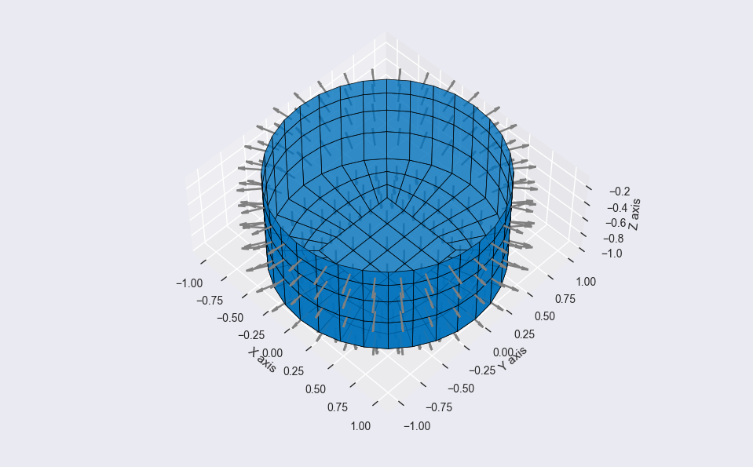

# Welcome to The PyMesh Docs

The [PyMesh](https://github.com/tviuff/pymesh) package handles basic geometry and facilitates the creation of 3-dimensional surface panels. These surface panels are converted into a low-order geometric data file for import and use in [WAMIT](https://www.wamit.com/).

## Package at a Glance

The `PyMesh` package is based on object-oriented programming with the fundamental `Point` class generating three-dimentional points. These are used as input for various curve classes derived from the `Curve` base class. The various derrived curve classes are in turn used as input for a variety of surface classes, all derived from the `Surface` base class. Using these building blocks, the user is able to make sofisticated three-dimensional surfaces.

The panel mesh is initialized with the `mesh = MeshGenerator` class and each `surface` is then added to the mesh with the `mesh.add_surface(surface, density_u, density_w, distribution_u)`. The other arguments govern the number of points Nu x Nw to be generated alung the surface `u` and `w` dimensions, as well as how these points should be distributed along each dimension.

To view the final mesh, a mesh viewer `viewer = MeshViewer(mesh)` is instanciated. It utilizes the `matplotlib` package to inspect the mesh geometry with the `viewer.show()` method.

Finally, the product of the `PyMesh` package is to write the panel mesh geometry into a text file. For this purpose, the `GDFWriter` class is used to generate a low-order geometric data file with the extension `.gdf`.

For more information the reader is refered to the [documentation](doc-pages/Point.md).

### Building a simple geometry in Python

```python
import math
from pathlib import Path

from pymesh import Point, Line, Arc3P, ArcPVA, PlaneSurface, RuledSurface, SweptSurface
from pymesh import MeshGenerator, ExponentialDistribution
from pymesh import MeshViewer, GDFWriter

DIAMETER = 2.0
RATIO = 0.4
DEPTH = 1

# Create one quarter of the circle plate inner part
point00 = Point(0, 0, -DEPTH)
point10 = Point(RATIO * DIAMETER / 2, 0, -DEPTH)
point01 = Point(0, RATIO * DIAMETER / 2, -DEPTH)
PlaneSurface(point00, point10, point01).flip_normal()

# Create one quarter of the circle plate outer part
point11 = Point(RATIO * DIAMETER / 2, RATIO * DIAMETER / 2, -DEPTH)
point11c = Point(DIAMETER / 2 / math.sqrt(2), DIAMETER / 2 / math.sqrt(2), -DEPTH)
point10c = Point(DIAMETER / 2, 0, -DEPTH)
point01c = Point(0, DIAMETER / 2, -DEPTH)
line10 = Line(point10, point11)
arc10 = Arc3P(point00, point10c, point11c)
RuledSurface(line10, arc10).copy().mirror(a=-1, b=-1, c=0).flip_normal()

# Create a full circular plate by copying and rotating existing surfaces
for surface in RuledSurface.get_all_surfaces():
    for angle in (90, 180, 270):
        surface.copy().rotate(angle * math.pi / 180, a=0, b=0, c=1)

# Add surfaces to the mesh generator and set mesh settings
mesh = MeshGenerator()
for surface in RuledSurface.get_all_surfaces():
    mesh.add_surface(surface, density_u=0.2, density_w=0.2)

# Create cylinder surface
circle = ArcPVA(Point(DIAMETER / 2, 0, -DEPTH), 2 * math.pi, a=0, b=0, c=1)
line = Line(Point(0, 0, -DEPTH), Point(0, 0, 0))
surface_cylinder = SweptSurface(circle, line)

# Add cylinder surface to the mesh generator and set mesh settings
mesh.add_surface(
    surface_cylinder,
    density_u=0.2,  # float indicating panel length
    density_w=4,  # int specifying numper of panels
    distribution_w=ExponentialDistribution(flip_direction=True),
)

viewer = MeshViewer(mesh)
viewer.show()

writer = GDFWriter(mesh)
writer.write(filename=Path("output", "cylinder.gdf"))
```

### Inspecting the final geometry

A `MeshViewer`, based on the `matplotlib` package, is used to conveniently plot and inspect the surface panels and their normals as shown in the image below.

```Python
# /examples/cylinder.py

viewer = MeshViewer(mesh)
viewer.show()
```



### Writing to a geometric data file

The `GDFWriter` takes care of converting the surfaces into a usable .gdf file.

```Python
# /examples/cylinder.py

writer = GDFWriter(mesh)
writer.write(filename=Path("output", "cylinder.gdf"))
```

Above code generates the following `/output/cylinder.gdf` output. For information regarding `GDFWriter` file formatting, the reader is referred to Section 6.1 in the [WAMIT Manual](https://www.wamit.com/manual7.x/v75_manual.pdf).

```
auto-generated using the pymesh package
1.000000 9.816000
0 0
240
+0.0000e+00 +2.0000e-01 -1.0000e+00 +2.0000e-01 +2.0000e-01 -1.0000e+00 +2.0000e-01 +0.0000e+00 -1.0000e+00 +0.0000e+00 +0.0000e+00 -1.0000e+00
+2.0000e-01 +2.0000e-01 -1.0000e+00 +4.0000e-01 +2.0000e-01 -1.0000e+00 +4.0000e-01 +0.0000e+00 -1.0000e+00 +2.0000e-01 +0.0000e+00 -1.0000e+00
+0.0000e+00 +4.0000e-01 -1.0000e+00 +2.0000e-01 +4.0000e-01 -1.0000e+00 +2.0000e-01 +2.0000e-01 -1.0000e+00 +0.0000e+00 +2.0000e-01 -1.0000e+00
+2.0000e-01 +4.0000e-01 -1.0000e+00 +4.0000e-01 +4.0000e-01 -1.0000e+00 +4.0000e-01 +2.0000e-01 -1.0000e+00 +2.0000e-01 +2.0000e-01 -1.0000e+00
+4.0000e-01 +0.0000e+00 -1.0000e+00 +4.0000e-01 +1.0000e-01 -1.0000e+00 +5.9360e-01 +1.3170e-01 -1.0000e+00 +6.0000e-01 +0.0000e+00 -1.0000e+00
+4.0000e-01 +1.0000e-01 -1.0000e+00 +4.0000e-01 +2.0000e-01 -1.0000e+00 +5.7463e-01 +2.6089e-01 -1.0000e+00 +5.9360e-01 +1.3170e-01 -1.0000e+00
+4.0000e-01 +2.0000e-01 -1.0000e+00 +4.0000e-01 +3.0000e-01 -1.0000e+00 +5.4382e-01 +3.8519e-01 -1.0000e+00 +5.7463e-01 +2.6089e-01 -1.0000e+00
+4.0000e-01 +3.0000e-01 -1.0000e+00 +4.0000e-01 +4.0000e-01 -1.0000e+00 +5.0237e-01 +5.0237e-01 -1.0000e+00 +5.4382e-01 +3.8519e-01 -1.0000e+00
+6.0000e-01 +0.0000e+00 -1.0000e+00 +5.9360e-01 +1.3170e-01 -1.0000e+00 +7.8719e-01 +1.6339e-01 -1.0000e+00 +8.0000e-01 +0.0000e+00 -1.0000e+00
...
```
